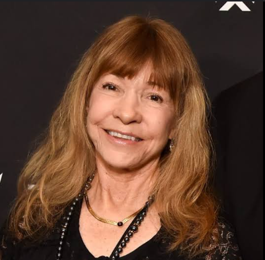

# Roberta Willians – Pioneira dos Jogos de Aventura

 

Roberta Willians é considerada uma das primeiras designers de jogos da história, sendo cofundadora da Sierra On-Line e criadora de franquias como *King's Quest*. Sua contribuição foi fundamental para os jogos de narrativa e aventura nos anos 80 e 90.

Este trabalho tem como objetivo aplicar os conceitos de **Qualidade de Software** com base na norma **ISO/IEC 25010**, utilizando como estudo de caso o sistema **AgroMart**, no contexto da disciplina de Qualidade de Software.

---

## Estrutura do Trabalho

1. Planejamento
2. Fase 1 – Escopo e Metas
3. Fase 2 – GQM e Características
4. Fase 3 – Projeto da Avaliação
5. Fase 4 – Execução e Métricas
6. Gestão do Projeto
7. Apresentação Final

---

> Desenvolvido por: Lucas Avelar  
> Curso: Engenharia de Software — UnB
